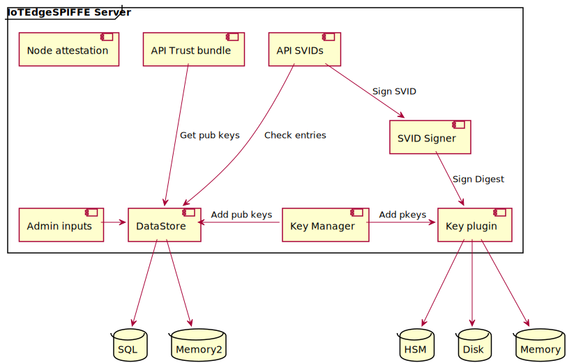

# IoTEdge SPIFFE Server

The IoTEdge SPIFFE Server is responsible for: 
-	Managing the key to sign the SVIDs
-	Signing the SVIDs
-	Managing the trust bundle
-	Attest the agents.

_Figure : IoTEdge SPIFFE Server_



“Admin inputs” are the configuration parameters from the “Identity Manager”. “Admin inputs” are a mix of:
-	 The configuration parameters like which plugin to use, configuration for the server API and more.
-	The SVIDs entries generated from the identity manager configuration.

The IoTEdge SPIFFE Server waits for the IoTEdge SPIFFE agent to connect. When an IoTEdge SPIFFE Agent connects for the first time, the server performs a node attestation together with the agent. 

After attestation, the IoTEdge SPIFFE server delivers a JWTSVID to the agent for future communications. Once the IoTEdge SPIFFE Agent receives its JWTSVID, it can communicate with the IoTEdge SPIFFE Server to get the trust bundle and the SVIDs.
-	The SVIDs are crafted based on Generating JSON Web Token structure using the signing key stored by the key plugin. 
-	The Trust bundle is also recorded in the common database since the trust bundle is a merge of the public keys of all the IoTEdge SPIFFE Server replicas. When there is a change in the Trust Bundle, the IoTEdge SPIFFE Agents are automatically notified.

The background task represents background operations like regularly rotating the signing keys.

# Testing the server
Some dummy commands to test and run the server

working directory: iot-edge-spiffe-server/serverd

## Add entries into the server:
### agent:
curl --unix-socket api.sock --request POST  http://localhost/entries?api-version=2022-06-01 --header "Content-Type: application/json"  -d "{\"entries\":  [{\"id\" : \"1\", \"other_identities\" : [], \"spiffe_id_path\" : \"agent\", \"admin\": true, \"expires_at\" : 0, \"dns_names\" : [\"mydns\"], \"revision_number\" : 0, \"store_svid\" : true, \"attestation_config\": {\"type\": \"NODE\", \"content\": {\"plugin\": \"PSAT\", \"value\": [\"AGENTSERVICEACCOUNT:iotedge-spiffe-agent\"] }} }]}"

### generic pod:
curl --unix-socket api.sock --request POST  http://localhost/entries?api-version=2022-06-01 --header "Content-Type: application/json"  -d "{\"entries\":  [{\"id\" : \"2\", \"other_identities\" : [{\"type\": \"IOTHUB\", \"content\": {\"iot_hub_hostname\" : \"myhub\", \"device_id\": \"my_device\", \"module_id\": \"modid\"}}], \"spiffe_id_path\" : \"genericnode\", \"admin\": true, \"expires_at\" : 0, \"dns_names\" : [\"mydns\"], \"revision_number\" : 0, \"store_svid\" : true, \"attestation_config\": {\"type\": \"WORKLOAD\", \"content\": {\"plugin\": \"K8S\", \"parent_id\" : \"1\", \"value\": [\"PODLABELS:app:genericnode\"] }} }]}"

### broker:
curl --unix-socket api.sock --request POST  http://localhost/entries?api-version=2022-06-01 --header "Content-Type: application/json"  -d "{\"entries\":  [{\"id\" : \"3\", \"other_identities\" : [], \"spiffe_id_path\" : \"mqttbroker\", \"admin\": true, \"expires_at\" : 0, \"dns_names\" : [\"mydns\"], \"revision_number\" : 0, \"store_svid\" : true, \"attestation_config\": {\"type\": \"WORKLOAD\", \"content\": {\"plugin\": \"K8S\", \"parent_id\" : \"1\", \"value\": [\"PODLABELS:app:mqttbroker\"] }} }]}"

## Check entries are entered:
curl --unix-socket api.sock "http://localhost/entries?api-version=2022-06-01&page_size=10"

## Get an SVID signed for that entry:
curl --request POST "http://localhost:8443/new-JWT-SVID?api-version=2022-06-01"  --header "Content-Type: application/json"  -d "{\"id\" : \"1\", \"audiences\": [\"my audience\"]}" 

## Get trust-bundle:
curl "http://localhost:8443/trust-bundle?api-version=2022-06-01&jwt_keys=true"

## Get Trust bundle to validate entries:

# Configuration


# Admin APIs
---
## Get entries
Get all entries. Because of possible flood of entried, results are paginated.
### Request
```
GET   /entries?api-version=2022_06_01&page_size={uint32}&page_token={string}
```

#### Params
```
page_size : uint32: The maximum number of results to return.
page_token: optional string: The page token
```
### Response
```
200 OK

content-type: application/json
```
### Response Body
```
{
    "entries" : [ 
        { 
          "id" : "string: Hash of the entry. Important if product is scaled horizontally. Replicas need to generate the same key",
          "other_identities" : [{ "type": "IOTHUB", "content" : {"iot_hub_hostname": "String", "device_id" : "test", "module_id" : "dummy" }}]
          "spiffe_id_path" : "string: The SPIFFE ID of the identity described by this entry.(excluding the trust domain"
          "selectors" : {"type" : "NODE", "content" : {  "Plugin": "PSAT", "value": ["string: selector1", "string: selector2", "...]},
          "ttl" : "uint64, svid time to live",
          "admin" : "bool: Admin workload",
          "expires_at" : "uint64: seconds since Unix epoch, when the entry expires",
          "dns_names" : ["string: used for crafting certificate"],
          "revision_number" : "uint64: version number of the entrie, bump when updated",
          "store_svid" : "bool: Determines if the issued identity is exportable to a store"
        },
        ...
    ],
    "page_token" "optional string: The page token. None if no more pages"    
}
```
---
## Create entries
Create entries that are entitled to SVIDs in IoTEdge SPIFFE Server. 
Gives access to related workload to the workload API.
### Request
```
POST   /entries?api-version=2022_06_01
```
#### Request Body
```
{
    "entries" : [ 
        { 
          "id" : "string: Hash of the entry. Important if product is scaled horizontally. Replicas need to generate the same key",
          "other_identities" : [{ "type": "IOTHUB", "content" : {"iot_hub_hostname": "String", "device_id" : "test", "module_id" : "dummy" }}]
          "spiffe_id_path" : "string: The SPIFFE ID of the identity described by this entry.(excluding the trust domain"
          "selectors" : {"type" : "NODE", "content" : {  "Plugin": "PSAT", "value": ["string: selector1", "string: selector2", "...]},
          "ttl" : "uint64, svid time to live",
          "admin" : "bool: Admin workload",
          "expires_at" : "uint64: seconds since Unix epoch, when the entry expires",
          "dns_names" : ["string: used for crafting certificate"],
          "revision_number" : "uint64: version number of the entrie, bump when updated",
          "store_svid" : "bool: Determines if the issued identity is exportable to a store"
        },
        ...
    ]
}
```
### Response
```
201 CREATED

content-type: application/json
```
### Response Body
```
{
    "results" : [ 
        { 
          "id" : "string: Hash of the entry. Important if product is scaled horizontally. Replicas need to generate the same key",
          "status" : "Error Status"
        },
        ...
    ]
}
```
## Update entries
Update entries in the IoTEdge SPIFFE Server
### Request
```
PUT   /entries?api-version=2022_06_01
```
#### Request Body
```
{
    "entries" : [ 
        { 
          "id" : "string: Hash of the entry. Important if product is scaled horizontally. Replicas need to generate the same key",
          "other_identities" : [{ "type": "IOTHUB", "content" : {"iot_hub_hostname": "String", "device_id" : "test", "module_id" : "dummy" }}]
          "spiffe_id_path" : "string: The SPIFFE ID of the identity described by this entry.(excluding the trust domain"
          "selectors" : {"type" : "NODE", "content" : {  "Plugin": "PSAT", "value": ["string: selector1", "string: selector2", "...]},
          "ttl" : "uint64, svid time to live",
          "admin" : "bool: Admin workload",
          "expires_at" : "uint64: seconds since Unix epoch, when the entry expires",
          "dns_names" : ["string: used for crafting certificate"],
          "revision_number" : "uint64: version number of the entrie, bump when updated",
          "store_svid" : "bool: Determines if the issued identity is exportable to a store"
        },
        ...
    ]
}
```
### Response
```
200 OK

content-type: application/json
```
### Response Body
```
{
    "results" : [ 
        { 
          "id" : "string: Hash of the entry. Important if product is scaled horizontally. Replicas need to generate the same key",
          "status" : "Error Status"
        },
        ...
    ]
}
```

---
## Delete entries
Delete entries in the IoTEdge SPIFFE Server. Deleting an entry will revoke access of the related workload to the workload API.
### Request
```
DEL   /entries?api-version=2022_06_01
```
#### Request Body
```
{
    "ids" : ["string: id1", "string: id2", ...]
}
```
### Response
```
200 OK

content-type: application/json
```
### Response Body
```
{
    "results" : [ 
        { 
          "id" : "string: Hash of the entry. Important if product is scaled horizontally. Replicas need to generate the same key",
          "status" : "Error Status"
        },
        ...
    ]
}
```

---
## Get entries 
Get the entries specified in the request.
### Request
```
POST   /select-listEntries?api-version=2022_06_01
```

#### Request Body
```
{
    "ids" : ["string: id1", "string: id2", ...]
}
```
### Response
```
200 OK

content-type: application/json
```
### Response Body
```
{
    "entries" : [ 
        { 
          "id" : "string: Hash of the entry. Important if product is scaled horizontally. Replicas need to generate the same key",
          "other_identities" : [{ "type": "IOTHUB", "content" : {"iot_hub_hostname": "String", "device_id" : "test", "module_id" : "dummy" }}]
          "spiffe_id_path" : "string: The SPIFFE ID of the identity described by this entry.(excluding the trust domain"
          "selectors" : {"type" : "NODE", "content" : {  "Plugin": "PSAT", "value": ["string: selector1", "string: selector2", "...]},
          "ttl" : "uint64, svid time to live",
          "admin" : "bool: Admin workload",
          "expires_at" : "uint64: seconds since Unix epoch, when the entry expires",
          "dns_names" : ["string: used for crafting certificate"],
          "revision_number" : "uint64: version number of the entrie, bump when updated",
          "store_svid" : "bool: Determines if the issued identity is exportable to a store"
        },
        ...
    ]
}
```
---
## Configure IoTEdge SPIRE Server
Configure SPIRE server. Configuring again will remove existing configuration.
### Request
```
POST   /configuration?api-version=2022_06_01
```
#### Request Body
```
{
    "trust_domain" : "string: SPIFFE ID trust domain",
    "Node_attestor_plugin" : "string: How node are attested",
    "Workload_attestor_plugin" : "string: How workload are attested" 
}
```
### Response

```
201 Created

content-type: application/json
```
---
# Server APIs
---
## Create and Get new JWTSVID
Request the server to create a new JWTSVID, sign it and return it

### Request
```
POST   /new-JWT-SVID?api-version=2022_06_01
```
#### Request Body
```
{ 
  "id" : "string: Hash of the entry. Important if product is scaled horizontally. Replicas need to generate the same key",
  "audience" : "string: list of audience for the JWT. At least one audience is required."
}
```
### Response
```
201 CREATED

content-type: application/json
```
### Response Body
```
{
    "jwt_svid" : {
        "token" : "string: Compact representation of the JWTSVID",
        "spiffe_id" : {
            "trust_domain" : "string: The trust domain",
            "path" : "string: The path component of the SPIFFE ID"
        },
        "expires_at" : "uint64: Expiration timestamp (seconds since Unix epoch).",
        "issued_at" : "uint64: Issuance timestamp (seconds since Unix epoch)."     
    }
}
```
---
## Get Trust Bundle
Gets the bundle for the trust domain of the server.

### Request
```
GET   /trust-bundle?api-version=2022_06_01&jwt_keys={bool}&x509_cas={bool}
```
#### Params
```
jwt_keys : bool: If true jwt_keys are included"
x509_cas: "bool: If true x509_cas are included"
```
### Response
```
200 OK

content-type: application/json
```
### Response Body
```
{
    "bundle" : {
        "trust_domain" : "string: The trust domain",
        "jwt_keys" : [{ (Optional, keys to authenticate the JWT => JWK)
            "public_key" : "byte: The PKIX encoded public key.",
            "key_id" : "string: The key identifier.",
            "expires_at" : "uint64: Expiry time in seconds since Unix epoch",
        },
        ...
        ],
        "x509_cas" : [{(Optional)
            "bytes" : "bytes : The ASN.1 DER encoded bytes of the X.509 certificate"
        },
        ...
        ],
        "refresh_hint" : "uint64: How often the trust bundle should be refreshed, in second",
        "sequence_number" : "uint64: The sequence number of the bundle." 
    }
}
```

# Catalog
The catalog is the IoTEdge SPIFFE Server database. It persists the following: Entries, Node selectors, JWK

## Interface

### Entries Interface
```
/// Entries are writen from the identity manager into the server. Entries contains all the necessary information
/// to identify a workload and issue a new about a SPIFFE identity to it.
#[async_trait::async_trait]
pub trait Entries: Sync + Send {
    /// Batch get registration entries
    ///
    /// ## Arguments
    /// * `ids` - ids of the entries.
    ///
    /// ## Returns
    /// * `Vec<(String, Result<RegistrationEntry, Error)>` - A vector the size of the input "ids". The first parameter
    /// of the tuple is the entryId, the second parameter is the entry if successful or an error
    async fn batch_get(
        &self,
        ids: &[String],
    ) -> Vec<(
        String,
        Result<RegistrationEntry, Box<dyn std::error::Error + Send>>,
    )>;

    /// Batch create registration entries
    ///
    /// ## Arguments
    /// * `Vec<RegistrationEntry>` -Vector containing all the ids to create.
    ///
    /// ## Returns
    /// * `Vec<(String, Result<((), Error)>` - A vector the size of the input "entries". The first parameter
    /// of the tuple is the entryId, the second parameter is () if successful or an error
    async fn batch_create(
        &self,
        entries: Vec<RegistrationEntry>,
    ) -> Result<(), Vec<(String, Box<dyn std::error::Error + Send>)>>;

    //Vec<(String, Result<(), Box<dyn std::error::Error + Send>>)>;

    /// Batch update registration entries
    ///
    /// ## Arguments
    /// * `Vec<RegistrationEntry>` -Vector containing all the ids to update.
    ///
    /// ## Returns
    /// * `Vec<(String, Result<(), Error)>` - A vector the size of the input "entries". The first parameter
    /// of the tuple is the entryId, the second parameter is () if successful or an error
    async fn batch_update(
        &self,
        entries: Vec<RegistrationEntry>,
    ) -> Result<(), Vec<(String, Box<dyn std::error::Error + Send>)>>;

    /// Batch delete registration entries
    ///
    /// ## Arguments
    /// * `ids` - ids of the entries.
    ///
    /// ## Returns
    /// * `Vec<(String, Result<(), Error)>` - A vector the size of the input "ids". The first parameter
    /// of the tuple is the entryId, the second parameter is () if successful or an error
    async fn batch_delete(
        &self,
        ids: &[String],
    ) -> Result<(), Vec<(String, Box<dyn std::error::Error + Send>)>>;

    /// List all resgitration entries
    ///
    /// ## Arguments
    /// * `page_token` - page token, was returned from previous list_all(_) call.
    /// * `page_size` - how many request in the page.
    ///
    /// ## Returns
    /// * `Ok((Vec<RegistrationEntry>, Option<String>))` - All the entries in the requested page with the page token of the next page. If no more page, page_token is None.
    /// * `Err(e)` - an error occurred while trying to List all the entries
    async fn list_all(
        &self,
        page_token: Option<String>,
        page_size: usize,
    ) -> Result<(Vec<RegistrationEntry>, Option<String>), Box<dyn std::error::Error + Send>>;

    /// Batch get registration entries
    ///
    /// ## Arguments
    /// * id of the entry
    ///
    /// ## Returns
    /// * Result<RegistrationEntry, Box<dyn std::error::Error + Send>>: The registration entry
    async fn get_entry(
        &self,
        id: &str,
    ) -> Result<RegistrationEntry, Box<dyn std::error::Error + Send>>;
}
```

### JWK Interface
```
/// The trust bundle store contains all the public keys necessary to validate  JWT tokens or trust certificates.
/// Those keys are writen by the key manager after a key rotation and read whenever the trust bundle is accessed.
/// The keys are sorted per trust domain.
#[async_trait::async_trait]
pub trait TrustBundleStore: Sync + Send {
    /// add a new public key for jwt in the catalog
    ///
    /// ## Arguments
    /// * `trust_domain` - trust domain for the key.
    /// * `jwk` - the jwk to add
    /// * `public_key` - public key.
    ///
    /// ## Returns
    /// * `Ok(())` - Successfully added the key
    /// * `Err(e)` - an error occurred while adding the key
    async fn add_jwk(
        &self,
        trust_domain: &str,
        jwk: JWK,
    ) -> Result<(), Box<dyn std::error::Error + Send>>;

    /// remove a public key for jwt from the catalog
    ///
    /// ## Arguments
    /// * `trust_domain` - trust domain for the key.
    /// * `kid` - unique key Id.
    ///
    /// ## Returns
    /// * `Ok(())` - Successfully deleted the key
    /// * `Err(e)` - an error occurred while deleting the key
    async fn remove_jwk(
        &self,
        trust_domain: &str,
        kid: &str,
    ) -> Result<(), Box<dyn std::error::Error + Send>>;

    /// get all public keys for give trust domain
    ///
    /// ## Arguments
    /// * `trust_domain` - trust domain for the key.
    ///
    /// ## Returns
    /// * `Ok((JWK, usize))` - Array of JWK and the version number
    /// * `Err(e)` - an error occurred while getting the keys for the give trust domain    
    async fn get_jwk(
        &self,
        trust_domain: &str,
    ) -> Result<(Vec<JWK>, usize), Box<dyn std::error::Error + Send>>;
}
```

## Storing
Data is stored in a key value store as a json file.

### Entries catalog
Note: the entries need to be ordered alphabetically.
```
{
   "entries":[
      {
         "id":"1",
         "other_identities":[
            {
               "type":"IOTHUB",
               "content":{
                  "iot_hub_hostname":"myhub",
                  "device_id":"my_device",
                  "module_id":"modid"
               }
            }
         ],
         "spiffe_id":{
            "trust_domain":"trust_domain",
            "path":"path"
         },
         "admin":true,
         "ttl":0,
         "expires_at":0,
         "dns_names":[
            "mydns"
         ],
         "revision_number":0,
         "store_svid":true,
         "attestation_config":{
            "type":"NODE",
            "content":{
               "plugin":"PSAT",
               "value":[
                  {
                     "type":"CLUSTER",
                     "content":"demo-cluster"
                  }
               ]
            }
         }
      }
   ]
}
```
### JWK catalog
```
{
   "version":0,
   "store":[
      {
         "myTrustDomain":{
            "keys":[
               {
                  "kty":"EC",
                  "kid":"C6vs25welZOx6WksNYfbMfiw9l96pMnD",
                  "crv":"P-256",
                  "x":"ngLYQnlfF6GsojUwqtcEE3WgTNG2RUlsGhK73RNEl5k",
                  "y":"tKbiDSUSsQ3F1P7wteeHNXIcU-cx6CgSbroeQrQHTLM",
                  "use":"jwt-svid"
               }
            ]
         }
      }
   ]
}
```
