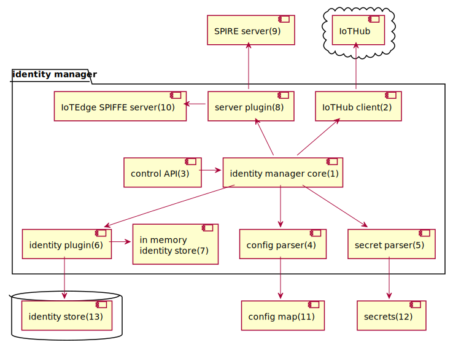

# IoTEdge Identity Manager
The identity manager manages a catalog of SPIFFE entries. Those entries contains information about workload identities like:
- OS/Framework primitive to identity a workload
- SPIFFE ID
- IoTHub identity

It makes sure that the catalog is in sync with the IoTEdge SPIFFE Server.

_Figure : Identity manager_

## Blocks
- (1) Identity Manager Core: The identity manager role is to create the SPIFFE identities the user desire in the SPIFFE server.
The identity manager tries to create identities in the cloud, and if it succeed it creates a SPIFFE identity coupled with the IoTHub identity in the SPIFFE server. If it fails, it creates a simple identity. If it succeed afterwards, the identity gets updates in the server.
- (2) Same IoTHub client as in Identity Service. It creates identities in IoTHub.
- (3) Optional control API: Can be used to do CRUD operations on entries or change the configuration dynamically
- (5, 11, 12, 5) Parse User configuration
- (6, 7, 13) Entries catalog. Persistent store may be used in high availability scenarios.
- (8, 9, 10) Server selection. Currently only IoTEdge SPIFFE Server is supported.

## Description
The identity manager creates entries based on the configurations provided by the user in the configMap (11) and in secrets (12) or based on the configuration provided through the control API(3).

An entry can be purely local or possess an IoTHub component. When an entry has an IoTHub component, the identity manager (1) will poll IoTHub regularly until it is able to create the new entry. When the identity in IoTHub is created, the entry is updated to reflect the new IoTHub component.

User can elect to store those entry either in memory or persist them in a database.

SPIFFE JWT tokens are the reflections of the entries contained in the identity manager (1). The identity manager (1) maintains the SPIFFE ID database up to date by accessing the IoTEdge SPIFFE server (10) or (9).  The SPIFFE server is either the SPIRE server, which is a reference implementation of the SPIFFE standard or our own implementation the “IoTEdge SPIFFE server”.

## Configuration
 
| Config option  | comments |
| ------------- |  ------------- |
| Trust_domain  | SPIFFE ID trust domain |
| Provisionning.IoTHub_hostname |  IoTHub hostname. Required if not using DPS |
| Provisionning.DeviceID | Device name in IoTHub. Required if not using DPS |
| Provisionning.Auth.Method | x509 or SAS (Eventually will disappear, will connect through session broker) |
| Provisionning.Auth.connection_string | Connection string |
| Provisionning.Auth.identity_pk | Path to private key |
| Provisionning.Auth.identity_cert | Path to public key |
| Server_socket_path | IoTEdge SPIFFE Server expose CRUD api so IoTEdge Identity Manager can Create/Request/Update and Delete Identities. This is the UDS interface. |
| Workload_attestation_plugin | Plugin type for workload attestation. |
| Node_attestation_plugin | Selected plugin for node attestation, PSAT, SAT or TPM |
| [Entry.SPIFFE_ID] | SPIFFE Id of the workload |
| [Entry.parent_id] | Optional field. Omitted only for IoTEdge SPIFFE Agent |
| [Entry.iot_hub_id] | Optional field "iot hub module id" |
| [Entry.selectors.type] | Node attestation or workload attestation (Depending if parent Id or not is present |
| [Entry.selectors.value] | Depends on the selected plugin, can be "serviceaccount" or "podlabel" |

